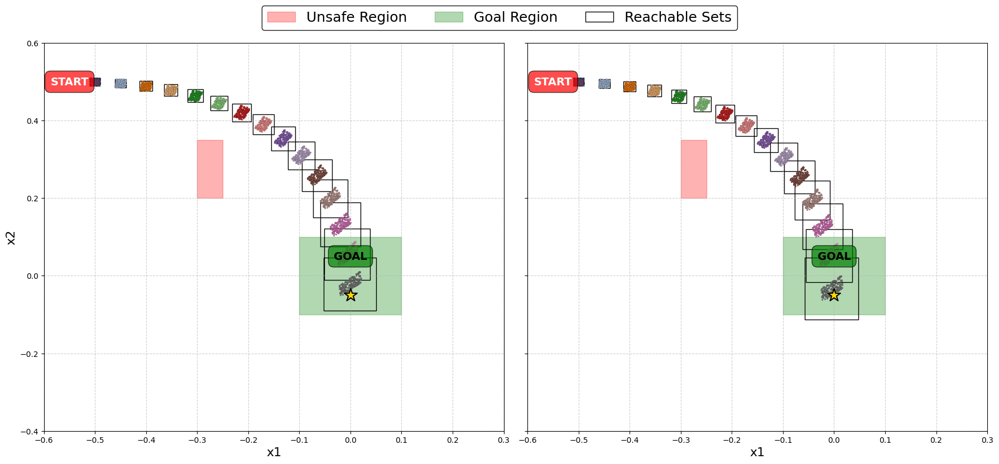

# Learning-Verifiable-Control-Policies-Using-Relaxed-Verification

## Parameter Visualizer

A unified controller verification notebook that compares different control strategies.

The visualizer (`notebooks/Parameter_Visualiser.ipynb`) provides:
- CROWN-based verification for linear and neural network controllers
- Gradient-based verification for linear and neural network controllers
- Visualization of reachable sets and sample trajectories

The tool loads pre-trained controllers from:
- `crown_*.pkl`: CROWN-verified controllers
- `gradient_*.pkl`: Gradient-based controllers

Results are saved as plots (e.g., `unicycle_navigation_crown_linear.png`) for analysis.

## Invariant Set Training and Verification

An approach that explicitly trains neural network controllers to induce invariant behavior:

**Definition**: An invariant set $S$ is a region where once a system enters, it remains forever:

$$x_t \in S \implies x_{t+1} = f(x_t) \in S \text{ for all } t \geq 0$$

The notebook (`notebooks/Invariant_Set_Training_for_Safe_Unicycle_Navigation.ipynb`) demonstrates:
- Training neural network controllers with invariance objectives
- Visualizing and verifying the resulting invariant regions
- Evaluating the controller's reach-avoid performance with safety guarantees

### Quadcopter Navigation with Verification in the Loop

A verification-guided approach for training safe 3D quadcopter controllers:

The notebook (`notebooks/Quadcopter_Navigation_with_Verification_in_the_Loop.ipynb`) demonstrates:
* Training neural network controllers with differentiable reachability analysis
* Visualizing 3D reachable sets that provably avoid obstacles
* Computing tight verification bounds suitable for runtime monitoring

### Verification-in-the-loop Training

Verification-in-the-loop training incorporates reachability analysis during optimization to produce controllers whose safety properties can be formally verified with lightweight algorithms.
The notebook (notebooks/CROWN_vs_Gradient_Verification_for_Unicycle_Navigation.ipynb) demonstrates:

* Training both linear and neural network controllers using verification-guided loss functions
* Implementing two distinct verification approaches (CROWN and gradient-based)
* Comparing safety guarantees and performance across controller types and verification methods

### Van der Pol Oscillator Verification Comparison

A comparative study of verification methods for the Van der Pol oscillator system:
The notebook (notebooks/1_van_comparision.py) demonstrates:

* Training neural network controllers with two distinct verification approaches
* CROWN-based verification achieving 5x faster training (38.97s total, 0.0078s per epoch)
* Finite difference verification showing different convergence properties (178.27s total, 0.0357s per epoch)